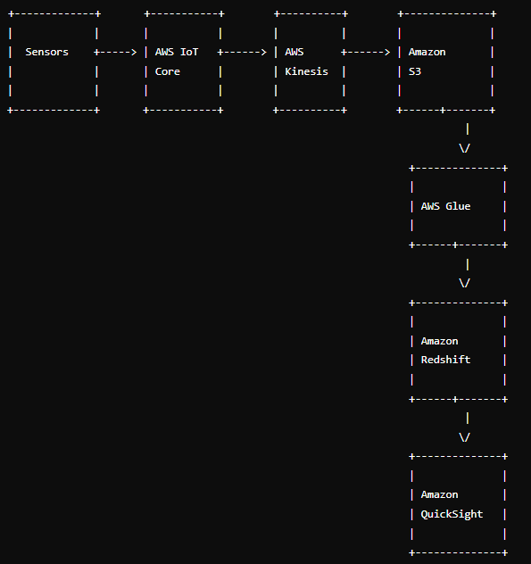

# Real-Time Sensor Data Platform

## Overview

This project involves designing, setting up, and implementing a real-time sensor data processing platform using AWS services. The platform handles data ingestion, storage, processing, aggregation, and visualization, catering to data sizes from 10MB to 100GB.

## Assignments

### Assignment 1: Architecture Design and Setup

1. **Design High-Level Architecture**
    - Components: Data Ingestion (AWS IoT Core), Data Storage (Amazon S3, Amazon Redshift), Data Processing (AWS Lambda, AWS Glue), Data Aggregation (AWS Glue), Data Visualization (Amazon QuickSight)
    - 

2. **GitHub Repository Setup**
    - Repository: `Real-Time-Sensor-Data-Platform`

3. **README.md**
    - Overview of the project and architecture diagram.

4. **AWS Services Setup**
    - AWS IoT Core, S3, Lambda, Glue, Redshift, QuickSight.

### Assignment 2: Data Ingestion and Processing

1. **Implement Data Ingestion**
    - Use AWS Kinesis Data Streams to stream data from a source to Amazon S3.
    - **Script**: `data_ingestion/kinesis_producer.py`

2. **Develop Data Processing Pipeline**
    - Use AWS Glue to process data.
    - **Script**: `data_processing/glue_jobs/data_processing.py`

3. **Apply Data Transformation and Cleansing**
    - Transform and cleanse the data for aggregation and analysis.

4. **Implement Data Partitioning and Indexing**
    - Optimize query performance using data partitioning and indexing strategies.

5. **Update GitHub Repository**
    - Code and configuration files for data ingestion and processing.


## Detailed Instructions and Files

### Assignment 1

#### data_ingestion/iot-core-setup.md

```markdown
# AWS IoT Core Setup

## Steps

1. **Create an IoT Core Thing**:
    - Go to AWS IoT Core in the AWS Management Console.
    - Click on "Manage" and then "Things".
    - Click on "Create" and follow the prompts to create a new thing.
    - Name your thing (e.g., `SensorThing`).

2. **Set Up Certificates and Policies**:
    - Create a new certificate and download it along with the private key, public key, and root CA.
    - Attach a policy to the certificate to allow data ingestion.

3. **Configure MQTT Topics**:
    - Set up MQTT topics for sensor data ingestion.

4. **Test the Configuration**:
    - Use AWS IoT Core's test feature to verify data ingestion.

## Configuration File

```json
{
  "thingName": "SensorThing",
  "certificateArn": "arn:aws:iot:region:account-id:cert/unique-cert-id",
  "policyName": "SensorPolicy",
  "mqttTopic": "sensor/data"
}


#### data_storage/s3-setup.md

```markdown
# Amazon S3 Setup

## Steps

1. **Create an S3 Bucket**:
    - Go to S3 in the AWS Management Console.
    - Create a new bucket named `sensor-data-bucket`.

2. **Configure Bucket Policies**:
    - Set up policies to allow access from AWS IoT Core and other services.

3. **Organize Data Storage**:
    - Create folders for raw and processed data.

## Example Policy

```json
{
  "Version": "2012-10-17",
  "Statement": [
    {
      "Effect": "Allow",
      "Principal": "*",
      "Action": "s3:*",
      "Resource": "arn:aws:s3:::sensor-data-bucket/*"
    }
  ]
}


#### data_storage/redshift-setup.md

```markdown
# Amazon Redshift Setup

## Steps

1. **Create a Redshift Cluster**:
    - Go to Redshift in the AWS Management Console.
    - Create a new cluster and configure it.

2. **Set Up IAM Roles**:
    - Create an IAM role that allows Redshift to access S3.

3. **Configure Data Warehouse**:
    - Set up the schema and tables for storing processed data.

## Example Schema

```sql
CREATE TABLE sensor_data (
    id INT IDENTITY(1,1),
    sensor_id VARCHAR(50),
    timestamp TIMESTAMP,
    data JSON,
    PRIMARY KEY(id)
);


#### data_processing/lambda-functions/process_data.py

```python
import json
import boto3

def lambda_handler(event, context):
    # Process the incoming data
    data = json.loads(event['body'])
    
    # Transform the data as required
    processed_data = transform_data(data)
    
    # Store the processed data in S3
    s3 = boto3.client('s3')
    s3.put_object(Bucket='sensor-data-bucket', Key='processed/data.json', Body=json.dumps(processed_data))
    
    return {
        'statusCode': 200,
        'body': json.dumps('Data processed successfully')
    }

def transform_data(data):
    # Example transformation logic
    transformed_data = {
        'sensor_id': data['sensor_id'],
        'timestamp': data['timestamp'],
        'value': data['value'] * 2  # Example transformation
    }
    return transformed_data


