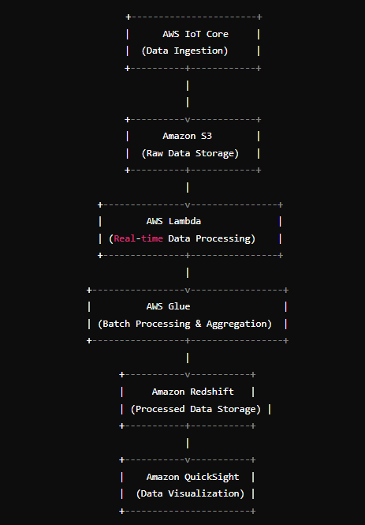

# Real-Time Sensor Data Platform

## Overview
This project involves designing and setting up a real-time sensor data processing platform using AWS services. The platform ingests data from sensors, processes it in real-time, stores both raw and processed data, and provides visualizations for aggregated data.

## Architecture Diagram

## Components
- **Data Ingestion**: AWS IoT Core
- **Data Storage**: Amazon S3 and Amazon Redshift
- **Data Processing**: AWS Lambda and AWS Glue
- **Data Aggregation**: AWS Glue
- **Data Visualization**: Amazon QuickSight

## Setup Instructions
Detailed setup instructions for each component are provided in their respective directories.
